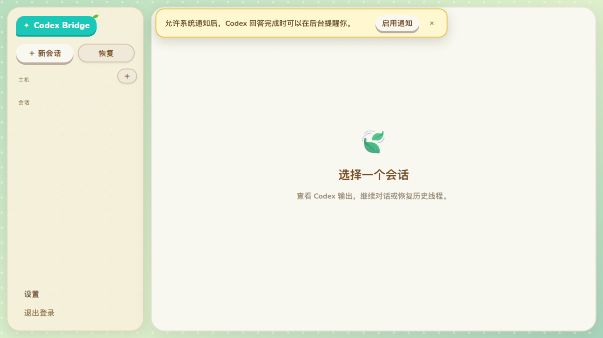

# Codex Web Bridge

Codex Web Bridge is a single-user bridge daemon, web dashboard, and CLI for running Codex sessions on local or remote machines over SSH.

It keeps Codex running inside persistent `tmux` sessions, exposes structured conversation events in the browser, and lets you manage threads without moving your code or Codex credentials onto the bridge host.

<p align="center">
  
</p>

## What It Does

- Run Codex on any SSH-reachable machine.
- Manage threads from a browser or CLI.
- Stream structured Codex output instead of scraping terminal text.
- Resume surviving sessions after SSH disconnects or daemon restarts.
- Keep dashboard state in a local SQLite database.

## How It Works

The bridge daemon runs on one machine and connects to target machines over SSH. Each bridge thread maps to one remote `tmux` session:

- One pane runs `codex app-server`.
- A viewer pane is attached on demand after the first accepted turn.
- The browser talks to the daemon over HTTP and WebSocket.
- The CLI talks to the daemon over a private Unix socket.

```text
Browser ──HTTP/WS──> Bridge Daemon ──SSH──> tmux ──> codex app-server
                    │                       └──> codex resume viewer
                    ├── CLI via Unix socket
                    └── SQLite state
```

## Who This Is For

Use Codex Web Bridge if you want:

- a lightweight self-hosted dashboard for Codex sessions
- persistent remote sessions that survive your local disconnects
- SSH-based execution without putting Codex login state on the bridge host
- both browser and CLI control over the same session inventory

## Prerequisites

Bridge host:

- Linux
- Node.js 22.13+
- pnpm 11

Target machine:

- SSH server
- `tmux`
- `codex` CLI available in `PATH` or reachable through a configured prepend path

## Quick Start

### 1. Install and build

```bash
git clone <repository-url> codex-web-bridge
cd codex-web-bridge
pnpm install
pnpm build
```

### Standalone binary

Build a self-contained executable:

```bash
pnpm build:binary
./release/codex-web-bridge-linux-x64-gnu help
```

### 2. Start the daemon

```bash
pnpm cwb start
pnpm cwb dashboard
```

On first start, the daemon generates a dashboard password and prints it once. Only the password hash is stored.

By default the dashboard listens on `http://127.0.0.1:3210`.

### 3. Add a host

```bash
pnpm cwb host add user@target-machine --password
```

The CLI verifies the SSH host key before the host is saved.

### 4. Create a thread

In the dashboard:

- log in
- add or select a host
- create a thread with an absolute working directory

Or from the CLI:

```bash
pnpm cwb thread create --host machine-a --cwd /srv/project
pnpm cwb thread send THREAD_ID --text "Review the project structure"
pnpm cwb thread wait THREAD_ID
```

## Main User Flows

### Create a new session

Create a bridge thread for a target host and working directory. The bridge starts a managed `tmux` session and creates a fresh Codex thread through `codex app-server`.

### Resume existing Codex history

Use the dashboard Resume flow or CLI resume command to attach a bridge thread to an existing Codex thread ID on a host.

### Interact with pending requests

The dashboard renders approvals and question prompts as structured UI actions. You can approve file changes, command execution, permissions, and answer user-input prompts directly.

### Use the terminal view

The terminal is read-only by default. After the first accepted turn, you can explicitly take over the viewer pane and send keyboard input through tmux.

## CLI Overview

```text
cwb start|stop|restart|status|dashboard
cwb password [reset|set PASSWORD]

cwb host list|get|add|upsert|delete
cwb host codex-threads HOST_ID

cwb thread list|get|create|resume|send
cwb thread wait|watch|interrupt|exit|delete

cwb request list|get|approve|decline|answer

cwb terminal screenshot|watch|takeover|input
```

Add `--json` for machine-readable output.

## Deployment

### Loopback-only local use

The default setup listens on `127.0.0.1` and is suitable for local browser access on the bridge host.

### Public HTTPS with Caddy

Use a reverse proxy for public access. The repository includes [deploy/Caddyfile.example](deploy/Caddyfile.example).

Start the daemon with the matching public origin:

```bash
pnpm cwb start --origin "https://bridge.example.com"
```

### systemd service

Use [deploy/systemd/codex-web-bridge.service.example](deploy/systemd/codex-web-bridge.service.example) as a starting point for a long-running service.

## Development

```bash
pnpm typecheck
pnpm test
pnpm build
pnpm --filter @cwb/server test:integration
```

## Documentation

Agent-focused project documentation lives in [docs/README.md](docs/README.md).

## Acknowledgements

- [botmux](https://github.com/deepcoldy/botmux)
- [animal-island-ui](https://github.com/guokaigdg/animal-island-ui)

## License

This project is licensed under the MIT License. See [LICENSE](LICENSE).
